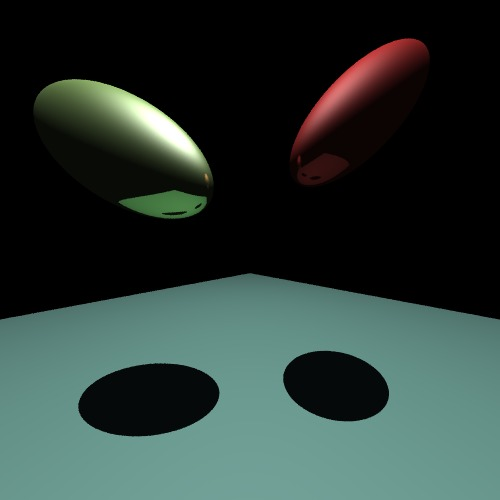

# Ray-Tracer
This Ray Tracer is my fourth year computer graphics course work. 

Here are what I implemented:
* Ray Casting
* Intersection of squares, spheres and cylinders
* Normal Transformations
* Local Phong
* Shadows
* Global Reflection
* Antialiasing
* Texture mapping
* Area light sources
* Multi-threaded rendering
* Refraction
* Normal mapping

# Examples
`Phong Reflection = Ambient + Diffuse + Specular`

### Ambient

### Diffuse

### Specular

### Full Phong model

### Full ray tracing with scene and all implementations

